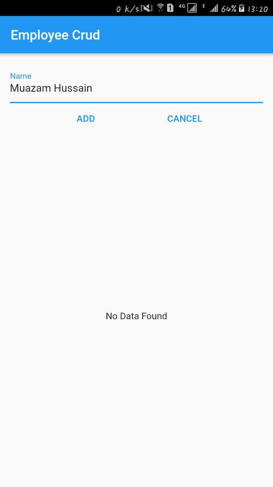
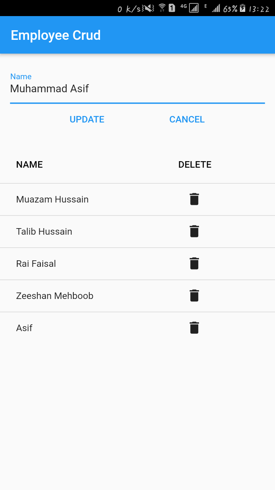

# crud_app

This is simple Employee Crud app which is developed in flutter using SQLite database.

## About

In this application user can add new employee, update existing employee and delete an employee. There is also form validation if user enter empty name.

# Screenshots

## No Employee

## Validation Error

## Add Employee

## Employees List

## Update Employee

## Delete Employee

